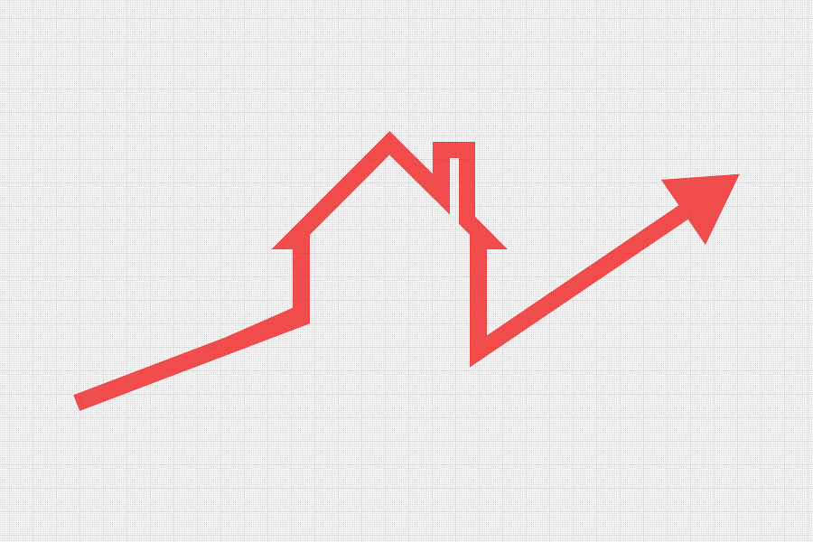

  </a>

## Real Estate Valuator (REV)

Ever wondered how your house is appraised or what your property is truly worth? The Real Estate Valuatior (REV) allows users to input property characteristics and receive an estimated value based on both current and historical data. While the system is designed to handle various types of property valuations, this project specifically focuses on the Croatian real estate market.

### Project Overview

This project was developed as part of my undergraduate capstone. The goal was to create a system capable of scraping and analyzing real estate market data to provide accurate property valuations. Given that property transactions in Croatia are not publicly accessible, the system relies on scraping real estate ads, assuming these listings are a reliable representation of the market.

Once the data is collected, it is cleaned and organized into a 'tidy' format before being stored in a database. Users can then access the system through an intuitive interface to evaluate or explore potential property purchases.

### Current Status

This project is currently archived and in need of a rewrite. However, it served as a foundational step in understanding real estate valuation methodologies and data processing techniques.
